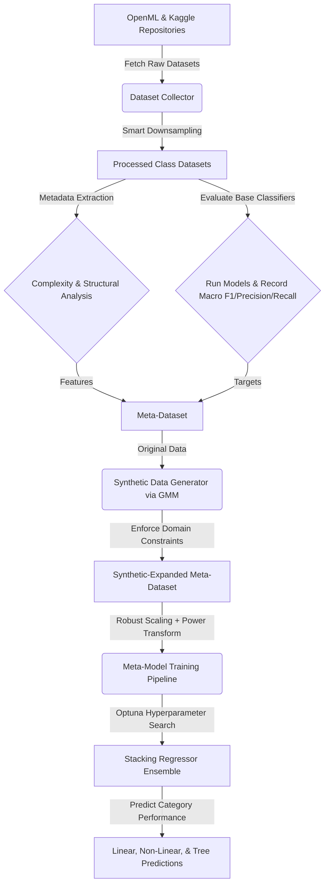
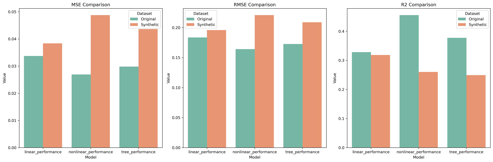
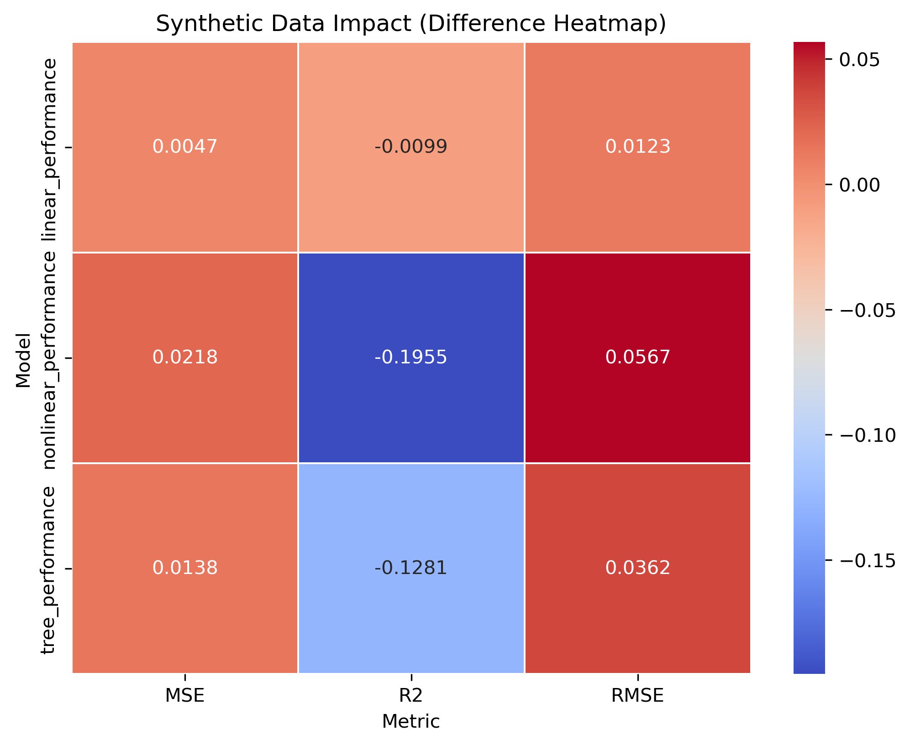
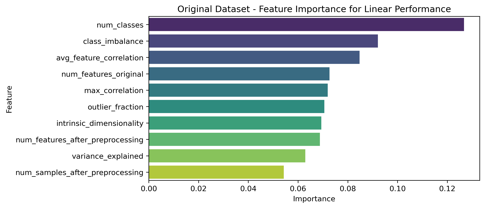
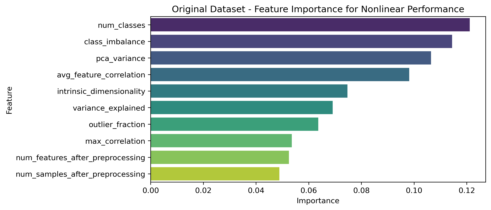
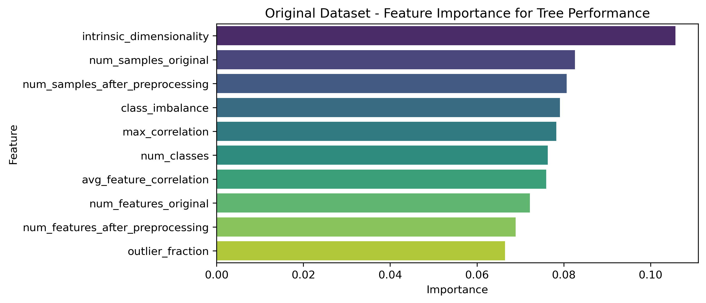

# Predicting Machine Learning Model Performance from Dataset Characteristics

This repository contains the source code, data extraction pipelines, synthetic data engines, and meta-learning models for the research paper:

> **Predicting Machine Learning Model Performance from Dataset Characteristics**  
> *Published in:* Lecture Notes in Networks and Systems (Springer, Vol. 1529, pp. 146–153), Proceedings of the 7th International Conference on Intelligent and Fuzzy Systems (INFUS 2025), Istanbul, Turkey.  
> *Authors:* Alkım Gönenç Efe, Tuğba Çelikten, Ahmet Emre Ergün, and Aytuğ Onan.

---

## Paper Abstract & Summary

Selecting the optimal machine learning classifier for a new dataset is traditionally a resource-intensive, trial-and-error process. This paper presents a **meta-learning framework** that predicts the performance metrics (accuracy, recall, and F1 score) of three primary categories of machine learning algorithms—**linear, non-linear, and tree-based**—directly from the structural and geometric characteristics of a classification dataset. 

By extracting multi-dimensional metadata features (including intrinsic dimensionality, PCA variance, and outlier fraction) from hundreds of open-source classification datasets, we construct a meta-dataset mapping dataset metadata to classifier outcomes. We then train a stacked regressor optimized via Optuna to model this relationship. Additionally, we integrate **Gaussian Mixture Models (GMM)** with strict domain constraints to generate realistic synthetic datasets, expanding the training space and improving prediction generalizability. The framework provides a practical tool to identify optimal classification models without running exhaustive training grids, saving significant computational time and resources. Empirically, the optimized stacking meta-regressor yields high predictive capability, achieving $R^2$ scores of **`0.4555`** for non-linear performance, **`0.3773`** for tree-based performance, and **`0.3283`** for linear performance on the original dataset evaluation.

---

## Framework Architecture

The framework consists of a multi-stage pipeline as represented below:

---

## Extracted Dataset Characteristics (Meta-Features)

For each classification dataset, we extract a total of **15 structural and geometric features** to act as predictive meta-features for the regression pipeline:

| Meta-Feature Name | Description | Extraction Method |
| :--- | :--- | :--- |
| `num_samples_original` | Total count of raw samples in the dataset | Dimension check |
| `num_features_original` | Total count of raw features in the dataset | Dimension check |
| `num_samples_after_preprocessing` | Sample count after smart downsampling and filtration | Post-processing count |
| `num_features_after_preprocessing` | Feature count after dropping empty columns and low-variance variables | Post-processing check |
| `num_classes` | Total number of unique target classes ($2 \leq C \leq 50$) | Unique count |
| `binary_features` | Number of binary features present in the dataset | Uniqueness scanner |
| `categorical_features` | Number of categorical features present in the dataset | Uniqueness scanner / Object type check |
| `numeric_features` | Number of numerical features present in the dataset | Number type check |
| `class_imbalance` | Normalized imbalance index computed as $\frac{\text{ratio}-1}{\text{ratio}+1}$ | Class counts ratio comparison |
| `variance_explained` | Cumulative variance explained by the first 5 PCA components | TruncatedSVD on standardized features |
| `avg_feature_correlation` | Average absolute correlation between numeric features | Pearson correlation matrix (upper triangle) |
| `max_correlation` | Maximum absolute correlation between numeric features | Pearson correlation matrix (upper triangle) |
| `intrinsic_dimensionality` | Estimator of the geometric manifold dimension | Log-log linear regression of KNN distances |
| `pca_variance` | Count of components required to explain 95% variance | Full PCA cumulative variance threshold |
| `outlier_fraction` | Ratio of data points representing outliers | Ratio of points where absolute Z-score > 3 |

---

## Model Evaluation Scheme

To construct the target regression values, we evaluate three major classifier groups across the harvested datasets using an **adaptive stratified cross-validation** strategy:

### 1. Base Classifier Groups

*   **Linear Models**:
    *   *Passive Aggressive Classifier* (optimized for margin classification).
    *   *Ridge Classifier* (L2-regularized linear classification).
*   **Non-linear Models**:
    *   *Gaussian Naive Bayes* (probabilistic baseline).
    *   *RBF Support Vector Machine* (implemented via `RBFSampler` kernel approximation + `LinearSVC`).
*   **Tree-based Models**:
    *   *CatBoost Classifier* (gradient boosted decision trees).
    *   *Extra Trees Classifier* (extremely randomized ensemble trees).

### 2. Aggregation Strategy
For each classifier, we compute the macro-averaged **F1-score**, **Precision**, and **Recall**. The performance score for a model category (e.g., `linear_performance`) is calculated by taking the mean of these three metrics across all models within that specific category.

---

## Meta-Regressor Model & Stacking Architecture

The meta-model utilizes a stacking regressor ensemble to predict the performance of linear, non-linear, and tree-based categories based on the extracted meta-features.

*   **Preprocessing Pipeline**: Numeric features are scaled using a robust scaler (`RobustScaler`) to handle outliers, followed by a Yeo-Johnson power transformation (`PowerTransformer`) to normalize distribution.
*   **Hyperparameter Optimization**: `Optuna` is used to tune either a `RandomForestRegressor` or `GradientBoostingRegressor` over 50 trials by maximizing the cross-validated $R^2$ score.
*   **Stacking Ensemble Layout**:
    *   **Base Regressors**: 
        1. Optimized Regressor (selected via Optuna)
        2. RandomForestRegressor (estimators = 200)
        3. GradientBoostingRegressor (estimators = 200)
        4. Support Vector Regressor (SVR with RBF kernel)
    *   **Final Meta-Regressor**: RandomForestRegressor (estimators = 100)

---

## Experimental Results & Visualizations

The stacking regressor was evaluated on both the **Original Harvested Dataset** and the **Synthetic-Expanded Dataset** (including GMM-generated samples). Below are the performance results:

### Performance Metrics Table

| Target Model Category | Dataset Source | Mean Squared Error (MSE) | Root Mean Squared Error (RMSE) | Coefficient of Determination ($R^2$) |
| :--- | :--- | :---: | :---: | :---: |
| **Linear Performance** | Original Dataset | `0.0337` | `0.1836` | **`0.3283`** |
| **Linear Performance** | Synthetic Dataset | `0.0384` | `0.1959` | `0.3184` |
| **Nonlinear Performance** | Original Dataset | `0.0269` | `0.1641` | **`0.4555`** |
| **Nonlinear Performance** | Synthetic Dataset | `0.0488` | `0.2208` | `0.2600` |
| **Tree-based Performance** | Original Dataset | `0.0298` | `0.1727` | **`0.3773`** |
| **Tree-based Performance** | Synthetic Dataset | `0.0437` | `0.2089` | `0.2492` |

### 1. Performance Metrics & Synthetic Data Impact

We compare the test metrics (MSE, RMSE, $R^2$) across the models, highlighting the impact of synthetic data integration:

The difference in prediction error and variance between models trained on the original dataset and models expanded with GMM synthetic data is summarized in the impact heatmap:

---

### 2. Feature Importances for Performance Prediction

Feature importances show which dataset metadata characteristics are most influential in predicting how well linear, non-linear, and tree-based classification models will perform:

| Linear Models | Nonlinear Models | Tree-based Models |
| :---: | :---: | :---: |
|  |  |  |

*Key Takeaways:*
*   **Class Imbalance** and **Number of Classes** are highly critical across all models, directly influencing classifier behavior.
*   **Intrinsic Dimensionality** is the dominant factor in predicting the performance of linear classifiers (14.49%), highlighting the geometric complexity boundaries of linear hyperplanes.
*   **PCA Variance** and **Number of Original Samples** significantly impact non-linear and tree-based performance predictions.

---

### 3. Stacking Regressor Predictions: Actual vs. Predicted Performance

The following scatter plots visualize the actual macro performance scores vs. the predictions generated by the Stacking Regressor:

| Model Category | Original Dataset | Synthetic Dataset |
| :---: | :---: | :---: |
| **Linear** |  |  |
| **Nonlinear** |  |  |
| **Tree-based** |  |  |
